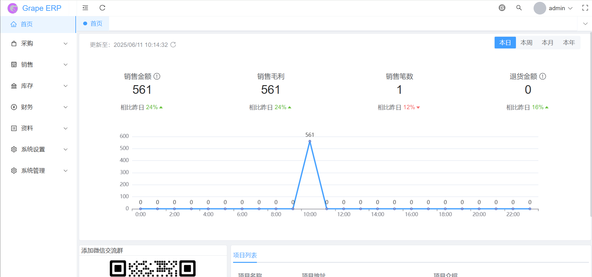
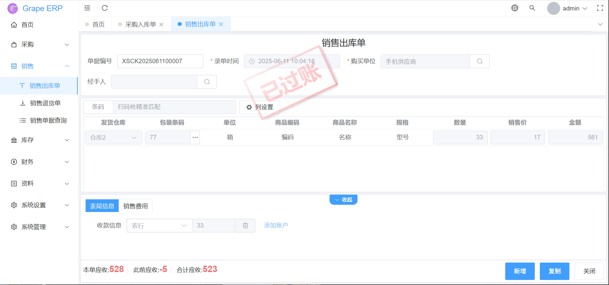
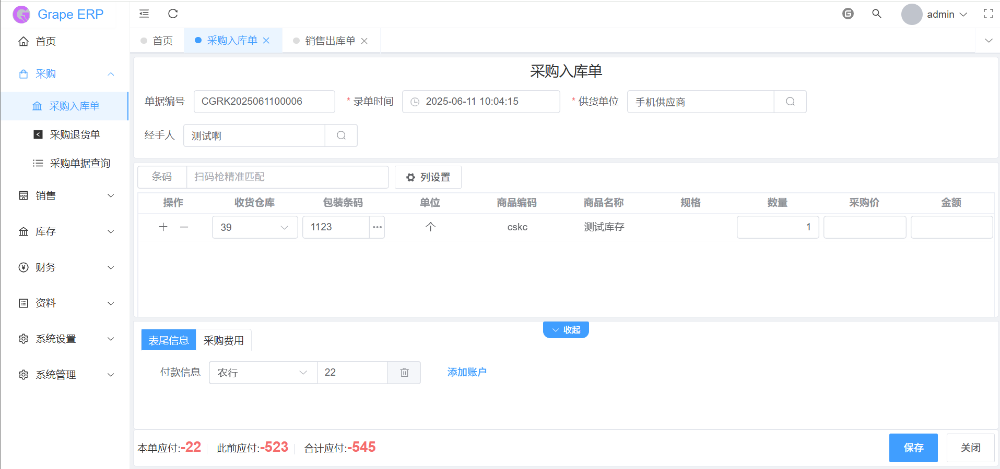

# 项目总描述
* 项目还在初级阶段，目前正在收集需求和快速的迭代产品中
* 各位有行业经验的可以提出宝贵意见

# 系统功能

| 系统功能 | 功能描述                        |
|------|-----------------------------|
| 系统管理 | 菜单、字典、参数、系统配置、部门、角色、用户、操作日志 、接口文档、短信、邮件、附件      |
| 资料 | 商品、供应商、客户、计量单位、仓库、类别、品牌、结算账号、收支项目            |
| 采购 | 采购入库单、采购退货单、采购单据查询     |
| 销售 | 销售出库单、销售退货单、销售单据查询                |
| 库存 | 调拨单、其他入库单、其他出库单、库存变动单据查询、库存状况查询                |
| 财务 | 支出单、收入单、付款单、收款单、收/付款单据查询                   |
| 多租户  | 支持多租户                       |

# 技术框架
* 后端框架：SpringBoot 3.4.2
			maven： 3.9.9

* 前端框架：Vue 3.4.38 + typescript 5.4.2,
* UI框架: element-plus 2.8.5

# 交流与支持
	微信 k1161095164
	邮箱 1161095164@qq.com

# 测试环境体验
<a href="http://47.101.175.183:88/login" target="_blank">http://47.101.175.183:88/login</a>
	账号 admin 密码 admin

# 开发环境
建议开发者使用以下环境，可以避免版本带来的问题
* IDE: IntelliJ IDEA 2019.2+和HBuilder X最新版
* DB: Mysql 8
* JDK: JDK 17
* Node: Node [18.x、20.x]
* Maven: Maven 3.2.3+
* Redis: 7.4.2
* Nginx: 1.26.3

# 开源说明
* 本系统100%开源，遵守GPL-3.0协议

# 如何支持
* 开源不易，坚持更难！如果您觉得grape-ERP不错,可以点个Star